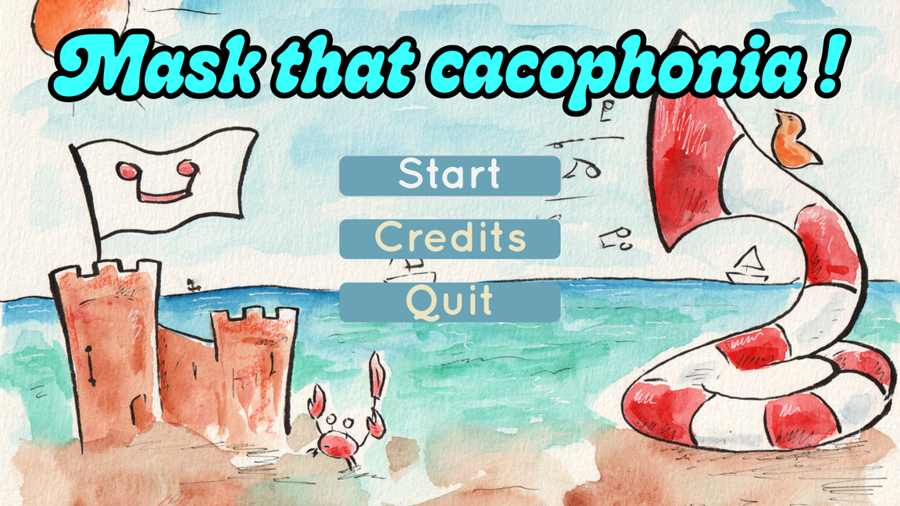
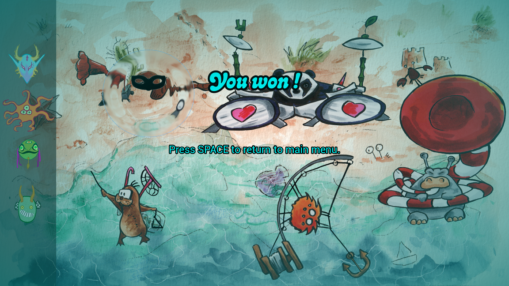

# Mask that Cacophonia

- GlobalGameJam 2026
- Godot v4.6
- [Itch.io final version](https://geekymoose.itch.io/maskthatcacophonia)
- [Original submission](https://globalgamejam.org/games/2026/mask-cacophonia-2)
- Spot the cacophony makers and mask them in the name of good music!

# Synopsis

Maestro Biduletruc and his orchestra were selected to participate in the yearly beach festival organized in their hometown!
Unfortunately, some musicians seem to be less prepared than others.
But Biduletruc has a solution: some time ago, he found five mysterious antique masks in a hidden cavern in the cliffs.
In very ancient tales, it is said that these masks have specific effects when worn while playing music, transforming saucepan musicians into virtuosos, or the opposite...

Play as Maestro Biduletruc, find who's creating a cacophony by flying over the band with his lens.
Cover those who need it with the right mask, and save the orchestra's performance at the beach festival!

# Controls

- Move with `Arrows` or `WASD`
- Interact with `Space` (or `left click`)
- Pause with `Esc`

# Music

All music was written and recorded during the gamejam.
We had the chance to have several talented musicians on the team.
It was pretty fun and really unexpected to see them playing the "bad" lines required by the game.

# Gamejam style

This game was created in 48 hours during the GlobalGameJam 2026.
After the jam, we spent an additional week polishing and fixing bugs.
We did some cleanup, added transitions and a victory screen, but did not introduce any new content.

The project is primarily a demonstration of an idea, with a strong emphasis on music.
Most of the team was relatively new to their respective areas of expertise (with the exception of music).
It was a rewarding challenge, but most importantly, we had a lot of fun making it.
Thank you all for such a great time!

# Credits

Credits for all tools and libraries used by the game.

- [Godot](https://godotengine.org/)
- [Godot SFXR](https://github.com/tomeyro/godot-sfxr)
- [Godot Debug Menu](https://github.com/godot-extended-libraries/godot-debug-menu)
- [Visual Studio Code](https://code.visualstudio.com/)
- [Krita](https://krita.org/en/)

# Team

- [Eva](https://github.com/saltyswan) (programming, game design)
- [Tiny](https://github.com/missfromaj) (ui, art)
- [Louis](https://github.com/lheuveline) (music, programming)
- [Wsmind](https://github.com/wsmind) (music, programming)
- [AuroreCello](https://github.com/AuroreCello) (music)
- [Geekymoose](https://github.com/geekymoose) (art, programming)

# Screenshots

Welcome page

Level

Victory

